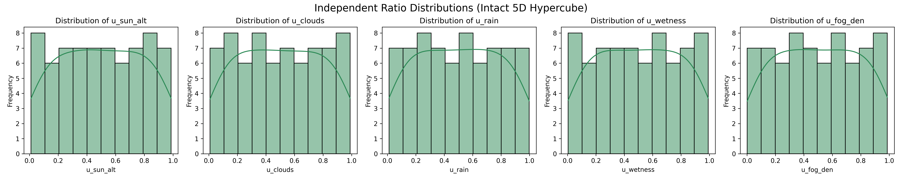
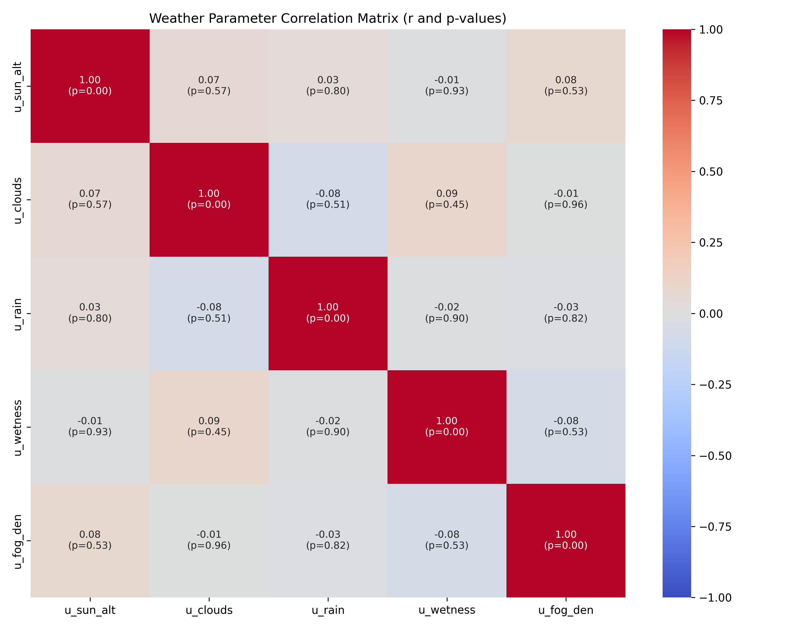
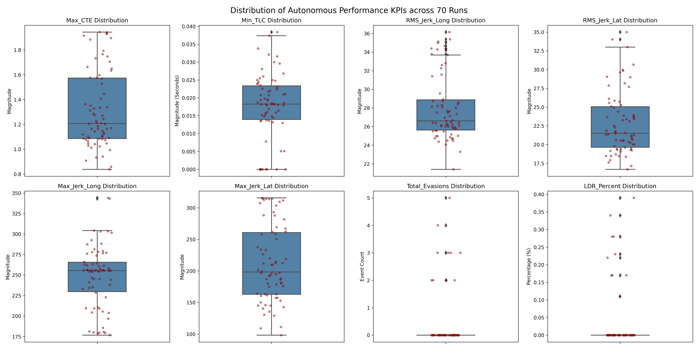
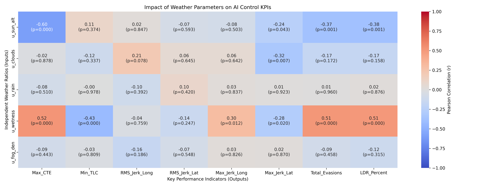
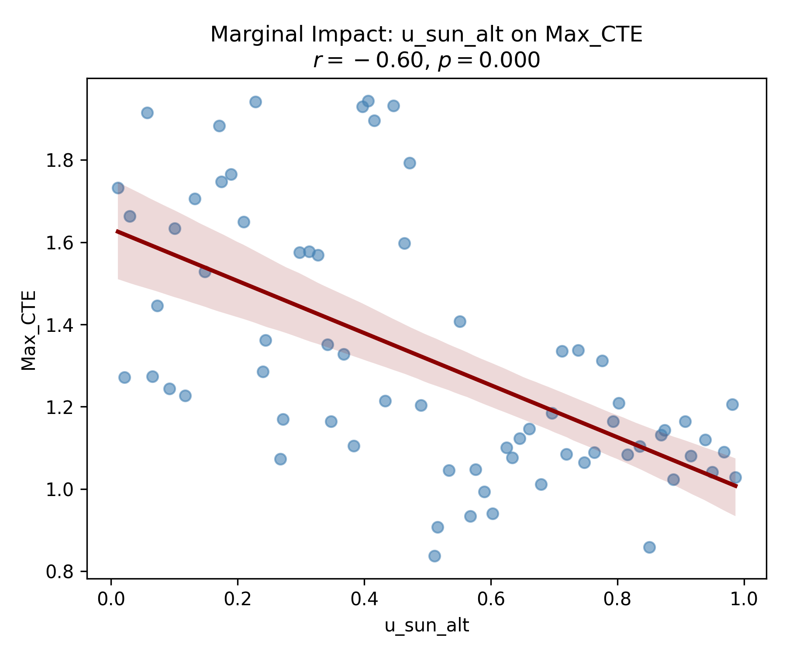
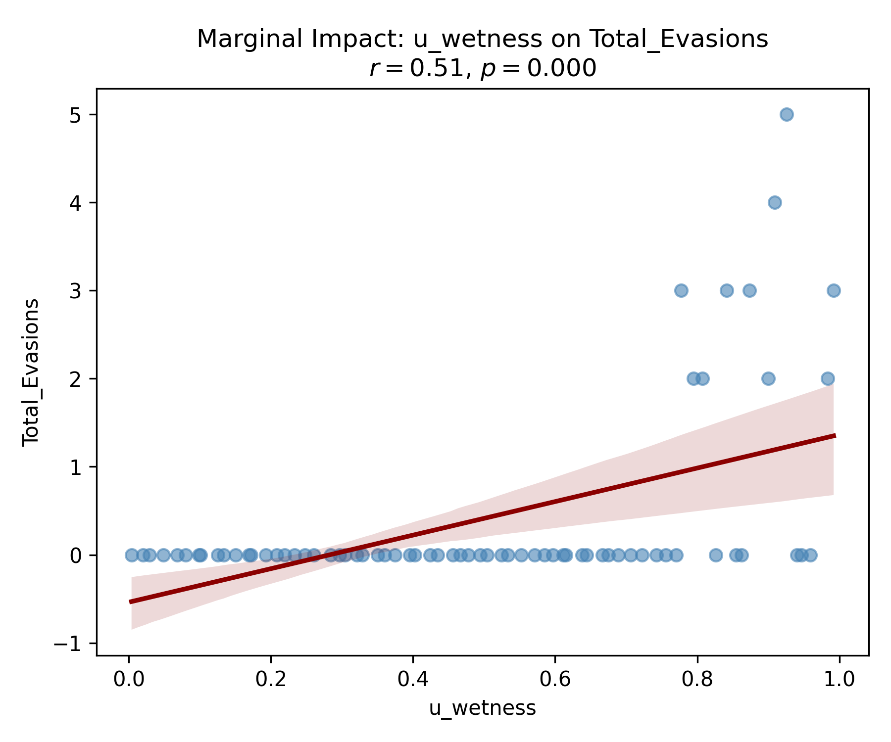
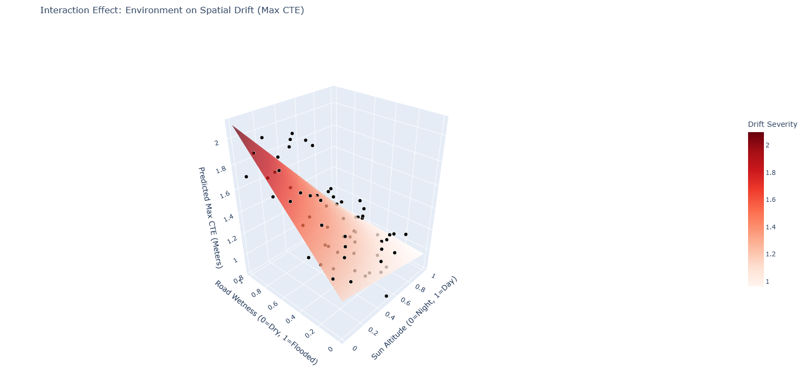
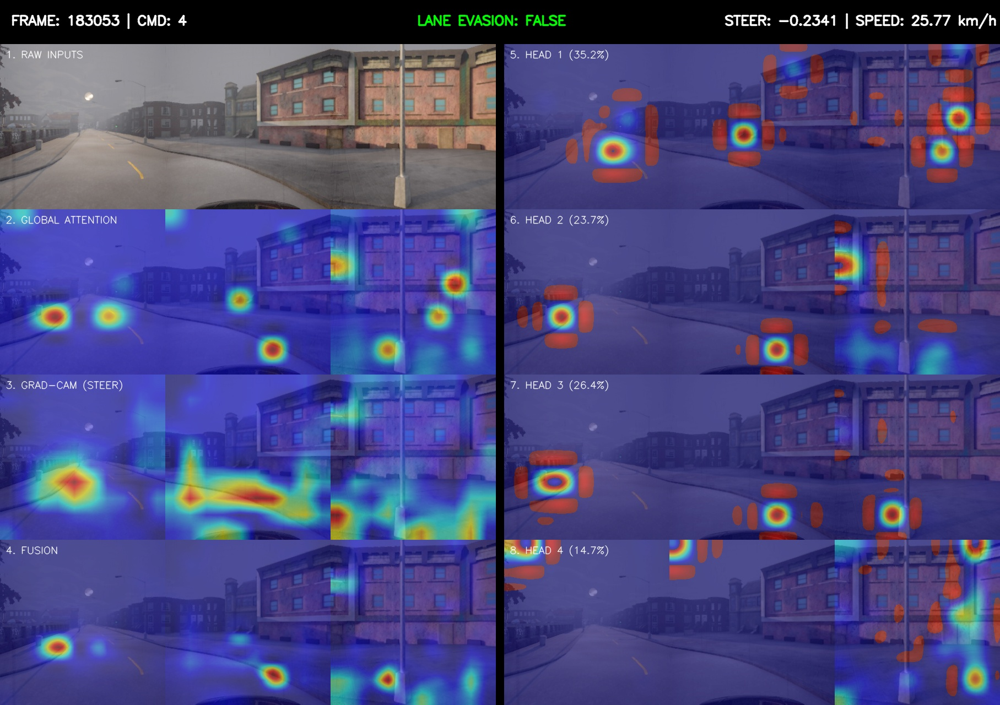
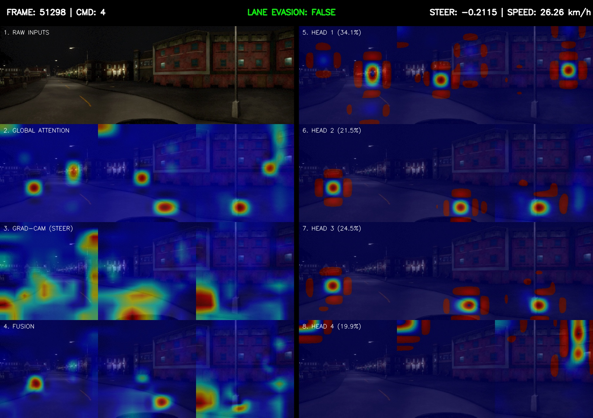

# CILv2-weather-testing
# Motivation
This repo was developed as a portfolio project to explore some subjects I am interested in, mainly Explainable AI (XAI), Vision-Action models, and the validation of autonomous vehicles. 

## Introduction and Objectives
This analysis aims to evaluate the performance of the CILv2 [here](https://arxiv.org/pdf/2302.03198), an End-to-End Autonomous Driving Visual-Action model, to identify scenarios where a specific weather condition can lead to hazard.

Because this testing is scenario-based and exploratory, it is inherently open-ended with no explicit operational design domain (ODD) requirements or strict pass/fail criteria provided by the original developers. I utilize traffic conflict techniques to evaluate the model's safety through surrogate safety measures, specifically focusing on path adherence and control stability under visual degradation.

For this analysis to be valid, we rely on several foundational assumptions:
* **The Accident-Conflict Axiom:** Traffic conflicts (such as severe lane deviations or extreme jerk) originate from the same underlying failure mechanisms as actual traffic accidents.
* **The Constant Velocity Hypothesis:** When calculating predictive safety metrics like Time to Line Crossing (TLC), we assume the vehicle maintains its current longitudinal and lateral velocity over the immediate prediction horizon.
* **The Unchanged Trajectory Hypothesis:** We assume the vehicle's current steering angle and acceleration vectors remain constant until the lane boundary is breached, meaning the AI does not initiate an emergency evasive maneuver during the micro-calculation window.

## Design of Experiment and Sampling

### Why test?
* **Characterize**
  * Want to know the effect of each factor on the response and how the factors may interact with each other.
* **Predict**
  * Want to predict responses for a given level(s) of the factor(s).
* **Optimize**
  * Want to find the levels of the factors that optimizes the responses.
* **Design**
  * Want to identify key parameters, compare alternatives.
* *Note: The points – Optimize and Design – are out of the scope of this project but one aim of this project is to try to come up with recommendations based on the statistical and XAI analysis.*

### Environmental Isolation & Constraints
To strictly isolate the impact of weather conditions, the simulation environment was completely cleared of dynamic traffic (other vehicles and pedestrians), and all traffic lights were permanently frozen to green. This ensures that any observed driving failures are purely the result of environmental visual degradation, not unpredictable traffic interactions.

Furthermore, due to the computationally intensive nature of rendering high-fidelity Unreal Engine weather physics while simultaneously running the neural network inference, we were strictly constrained in the total number of possible simulation runs. To maximize statistical validity within these compute and time constraints, we relied on Key Performance Indicators (KPIs).

## Scenario Definition

* **Functional scenario:** A car of the type Lincoln MKZ 2017 is driving in Town02 inside the CARLA simulation, taking route00, with no other dynamic actors on the road and with all stop lights set to green.
* **Logical Scenarios:** Detailed representation of functional scenarios with the help of state space variables. The input Factors are listed below, all drawn from a uniform distribution.

We test five independent environmental Factors:
1. **Sun Altitude** (Glare and lighting angles)
2. **Cloudiness** (Ambient light diffusion)
3. **Precipitation** (Active rain visual noise)
4. **Road Wetness** (Surface reflections and puddles)
5. **Fog Density** (Depth perception and contrast loss)

### Sampling Methodology
The sampling of these parameters is conducted using Latin Hypercube Sampling (LHS) to efficiently cover the parameter space. After iteratively generating and evaluating different sample sizes, we finalized a matrix of 70 runs. This specific size guaranteed that our parameters were sufficiently uniform and orthogonal.

* **Concrete scenarios:** After sampling, we have 70 concrete scenarios.

## Execution

The simulation and testing pipeline is driven by a decoupled architecture, separating the environmental scenario management from the neural network inference. This is handled primarily by two core scripts:

### 1. The Simulation Master (`orchestrator.py`)
This script acts as the high-level environment and scenario manager. Its primary responsibilities include:
* **Matrix Ingestion:** Reading the 70-run Latin Hypercube Sampling (LHS) test matrix.
* **World Initialization:** Connecting to the CARLA server, spawning Town02, and instantiating the ego-vehicle (Lincoln MKZ 2017) at the designated route starting point.
* **Environmental Control:** Dynamically applying the specific continuous weather parameters (Sun Altitude, Road Wetness, Cloudiness, etc.) for each specific run.
* **Data Logging:** Recording the continuous telemetry outputs (Cross-Track Error, Acceleration, Lane Invasions) at a fixed simulation time-step to generate the final analytical datasets.

### 2. The AI Driver (`unified_ai_control.py`)
This script operates as the autonomous agent, completely blind to the "ground truth" of the simulator, relying solely on its sensor suite. Its responsibilities include:
* **Sensor Fusion & Preprocessing:** Capturing the three front-facing RGB camera feeds (Left, Center, Right) and the current ego-speed, applying the necessary normalizations to match the CILv2 training distribution.
* **Inference Engine:** Loading the frozen CILv2 PyTorch model weights and executing the forward pass. It takes the visual feature maps, fuses them with the navigational command token, and calculates the required control vector.
* **Actuation:** Translating the network's continuous outputs back into discrete CARLA control commands (Steer, Throttle, Brake) and applying them to the vehicle chassis for the next simulation frame.

## Analysis

### KPIs
The analysis is centered around four main categories of KPIs:

* **Path adherence:** Measures how well the AI actions adhere to the path defined by the waypoints generated by CARLA. For that, I use Cross Track Error (CTE), which is the perpendicular distance between the current position and the intended reference line. We take the maximum of CTE for each run representing the worst-case scenario.
* **Critical Risk:** Measuring how close the vehicle came to a critical risk, leaving the lane. For that we use TLC which is the estimated time it takes for a vehicle to cross the boundary if it continued on its current trajectory. We take the minimum TLC for each run representing the worst-case scenario.
* **Control confidence:** I use four metrics: maximum and RMS jerk for the lateral and longitudinal movement.
* **Task Failure (Reality):**
  * **Total evasions:** The absolute number of times the vehicle's tires crossed the lane boundary.
  * **Lane Departure Ratio (LDR):** The percentage of the total simulation time the vehicle spent physically outside the bounds of its lane.

### Performance Baseline and Outlier Identification

I used the Interquartile Range (IQR) method (+- 1.5 * IQR) to define the operational limits for each metric, and to isolate all the outlier runs for further XAI analysis.

the outliers table is [here](analysis/outlier_runs_table.csv)

## Linear Correlations
This matrix evaluates the isolated linear relationship between the input factors and the KPIs.

### Sun altitude
**Sun altitude:**
The u_sun_alt vs Max_CTE plot demonstrates the model's highest individual point of failure. The strong negative correlation of -0.60 dictates that as the sun altitude parameter drops, spatial drift heavily increases. Visual inspection of the simulated RGB frames reveals that the lowest values do not represent horizon glare, but rather night conditions. This highlights a critical sensor limitation: the Visual-Action model relies entirely on standard RGB cameras, which suffers in low-light environments. 

### Wetness
**Wetness:**
Visual inspection reveals that road wetness does not cause linear degradation, but rather acts as a binary threshold trigger. At a ratio of ~0.6, reflection causes an abrupt decline in performance. If the road becomes a mirror at 0.6 wetness, that mirror is only dangerous if there is something bright to reflect.

### Control Confidence: The Limitations of Marginal Analysis
When analyzing the control stability of the Visual-Action model, we isolated both the continuous average instability (RMS Jerk) and the peak single-frame instability (Max Absolute Jerk).

Initial analysis revealed that continuous control confidence (RMS Jerk, both lateral and longitudinal) showed no statistically significant correlation with any isolated weather parameter. The model maintained a smooth baseline control policy regardless of gradual environmental degradation.

Peak instability (Max Jerk) exhibited low-magnitude correlations with specific conditions: Sun Altitude and Cloudiness negatively correlated with lateral jerk, while Road Wetness showed a slight positive correlation with longitudinal braking jerk.

However, because Max Jerk is an extreme value metric, applying standard linear correlation to these outliers within an N=70 sample size is volatile. Therefore, while we can confidently identify the thresholds where spatial tracking fails (CTE and TLC), we cannot definitively rule out the impact of weather on overall control confidence without a larger sample size to stabilize the peak variance.

## Interactions
Pearson correlation assumes the effect of all other factor are zero. For more accurate analysis of the factors and their interactions, running multiple linear regression with interactions. 

### MAX_CTE:
* **Prob (F-statistic):** 7.06e-09
* **R-squared:** 0.684
* **Adj. R-squared:** 0.597
  
**Overall Model Note:** This model is significant with strong explanatory power. But the drop in Adj. R-squared means there are insignificant input factors.

* `u_wetness`: Highly significant. The coefficient is 1.0664. This means that if everything else is held at zero, pushing the road wetness to maximum adds over a full meter of drift to the car.
* `u_sun_alt` alone has a p-value of 0.461. It is not statistically significant on its own in this model. Sun altitude doesn't crash the car by itself; it crashes the car because of what it interacts with.
* `u_sun_alt*u_wetness`: Highly significant. The coefficient is -0.8311.
  * **The Base Penalty** (`u_wetness` = +1.0664): in this equation, the main effect of wetness represents the danger of a wet road when the sun is at 0 (pitch black). A wet road at night is catastrophic. 
  * **The Rescue Factor** (`u_sun_alt:u_wetness` = -0.8311): This negative coefficient is counteracting to the wetness penalty. As the sun rises (moves from 0.0 to 1.0), it starts canceling out the danger of the wet road.

### MIN_TLC Interactions
* **Prob (F-statistic):** 0.0936
* **R-squared:** 0.313 
* **Adj. R-squared:** 0.122

**Overall Model Note:** The model is incredibly noisy (low Adjusted R-squared and marginal overall significance). However, the interaction term successfully cuts through this noise to highlight the exact same vulnerability found in the spatial drift analysis.

* `u_sun_alt*u_wetness`: Statistically significant (p = 0.025). The coefficient is +0.0312.
  * **The Base Penalty:** The main effect of wetness (`u_wetness`) has a coefficient of -0.0139. Because Time to Line Crossing (TLC) is a metric where lower is more dangerous, this negative coefficient means a wet road in pitch-black conditions (sun = 0) pushes the car closer to a crash.
  * **The Rescue Factor:** The interaction coefficient is +0.0312. As the sun rises (moves toward 1.0), this positive coeff. buys the car more time before crossing the lane boundary. 

### Total_Evasions Interactions
* **Prob (F-statistic):** 4.49e-09 
* **R-squared:** 0.690 
* **Adj. R-squared:** 0.604

**Overall Model Note:** This model is highly significant with strong explanatory power. The interaction terms confirm that the conditions causing the car to drift (CTE) are the exact same conditions causing the physical lane boundary evasions.

* `u_wetness`: Highly significant (p = 0.000). The coefficient is 6.4088.
  * **The Base Penalty:** In pitch-black conditions (sun = 0) with no clouds, pushing road wetness to maximum guarantees an average of over 6 lane evasions per run. The wet night environment is the primary catalyst for system failure.
* `u_sun_alt*u_wetness`: Highly significant (p = 0.000). The coefficient is -4.7187.
  * **The Rescue Factor:** Consistent with the spatial tracking KPIs, the rising sun acts as a massive negative multiplier. It mathematically suppresses the evasions caused by the wet road, dropping the penalty by almost 5 full evasions as the sun reaches its peak.
* `u_clouds*u_wetness`: Significant (p = 0.012). The coefficient is -2.9102.
  * **The Secondary Rescue:** Interestingly, cloud cover also mitigates the danger of a wet road. It’s likely because the clouds diffuse the ambient light, preventing the harsh reflections that blind the camera.
* `u_sun_alt*u_clouds`: Significant (p = 0.018). The coefficient is 2.8969.
  * **The Glare Penalty:** While clouds help mitigate wet roads, mixing maximum sun altitude with maximum cloud cover actually increase evasions. It’s likely due to bright sunlight diffusing through thick clouds creates a glare effect that degrades the vision model.

### LDR_Percent Interactions
* **Prob (F-statistic):** 1.26e-09 
* **R-squared:** 0.706 
* **Adj. R-squared:** 0.624

**Overall Model Note:** The Lane Deviation Ratio mirrors the Total_Evasions model almost perfectly, yielding the highest R-squared value of all the spatial KPIs. The statistical significance and the signs of the coefficients (+/-) are identical.

* `u_wetness`: Highly significant (p = 0.000). The coefficient is 0.5477.
  * **The Base Penalty:** At night, maximum road wetness adds roughly 54.7% to the vehicle's total Lane Deviation Ratio. The car spends more than half its time outside the drivable bounds.
* `u_sun_alt*u_wetness`: Highly significant (p = 0.000). The coefficient is -0.4012.
  * **The Rescue Factor:** The sun neutralizes the wetness penalty, pulling the LDR back down by roughly 40%.
* **Secondary Interactions:** Just like Total_Evasions, `u_clouds*u_wetness` acts as a rescue factor (-0.2366), and `u_sun_alt*u_clouds` acts as a penalty (+0.2773).

## Predictions
I ran another linear regression where the inputs are only the statistically significant factors or interactions. If an interaction exists as an input, its two components also are considered.

### Group A: Spatial Tracking (Max_CTE & Min_TLC)
For both of these metrics, the equations strictly require the main effects and their single interaction:
* `u_sun_alt`
* `u_wetness`
* `u_sun_alt*u_wetness`

### Group B: Boundary Failures (Total_Evasions & LDR_Percent)
For both of these metrics, the equations consider the following inputs:
`u_sun_alt`, `u_wetness`, `u_clouds`, `u_sun_alt*u_wetness`, `u_clouds*u_wetness`, `u_sun_alt*u_clouds`.

In the initial Max_CTE model, the Adjusted R-squared was 0.597. In this pruned model, it has increased to 0.659. The exact same phenomenon occurred for Total_Evasions, increasing from 0.604 to 0.641.

All details about the regression models can be found in `analysis/thesis_regression_summaries.txt` and `analysis/ols_regression.txt`.

## XAI Analysis and Insights

To validate the decision-making process of the autonomous driving model, I implemented a custom diagnostic tool. The PyTorch Grad-CAM library was failing to capture the dynamic routing of the architectures due to hardware-level memory optimizations and early-fusion embeddings. 

To overcome this, we engineered a custom Layer-wise Relevance Propagation (LRP) pipeline that manually extracts and un-projects the mathematical weights of the Transformer's attention heads on a frame-by-frame basis.

### Methodology
* **Gradient Interception:** We bypassed PyTorch's autograd memory cleanup by retaining the gradient on the 512-dimensional output tensor (Y).
* **Manual LRP Un-projection:** We extracted the frozen Output Projection matrix ($W^O$) and performed a manual reverse-projection ($\nabla X = \nabla Y \cdot W^O$).
* **Dynamic Attribution:** By slicing the un-projected gradient back into its 4 independent 128-dimensional subspaces, we calculated the exact, dynamic percentage of steering authority yielded by each Attention Head per frame.

### Key Findings
By combining these dynamic attention weights with ResNet-level Grad-CAM extractions, we established a composite 4x6 Master Diagnostic Panel. The analysis of pre-lane-evasion and stable-driving frames revealed two behaviors:

* **Cognitive Division of Labor:** The model actively shifts processing power between its 4 attention heads based on the situation, but for most of the frames the heads have a near global importance that rarely changes, 1 > 2 > 3 > 4. 
* **Uncertainty and Feature Confidence:** In frames immediately preceding a lane evasion (particularly in low-light environments), the Grad-CAM visualizations demonstrate spatial diffusion.

The model ignores painted lane lines and instead it anchors its steering to:
* **Road Boundaries:** Where the gray asphalt meets the sidewalk, grass, or buildings.
* **Distant Point:** Tracking the horizon to keep the car centered globally rather than locally.

### Insight 1: Spatial Diffusion vs. Concentration

Comparing between frames [Run 21] and [Run 07]:
#### Run 21
*Run 21 (Sunny)*: The Grad-CAM blobs are tight, highly concentrated, and localized. The ResNet has found highly specific features it trusts to drive the steering gradient.

#### Run 07
*Run 07 (Night / Pre-Evasion)*: The Grad-CAM gradient is more dispersed across the center camera and the right side of the left camera. 

My reasoning is that the ResNet is experiencing low feature confidence. Because the lighting is poor, the textures it normally relies on are missing. The network is allowing weak gradients from irrelevant features to influence the steering output.

## Further work

### more samples which would allow us to do [] []

#### 1
#### 1
#### 1
#### 1

#### 1
#### 1
#### 1
#### 1
#### 1
placeholders

............................................................
